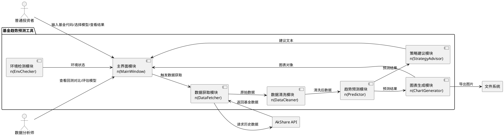
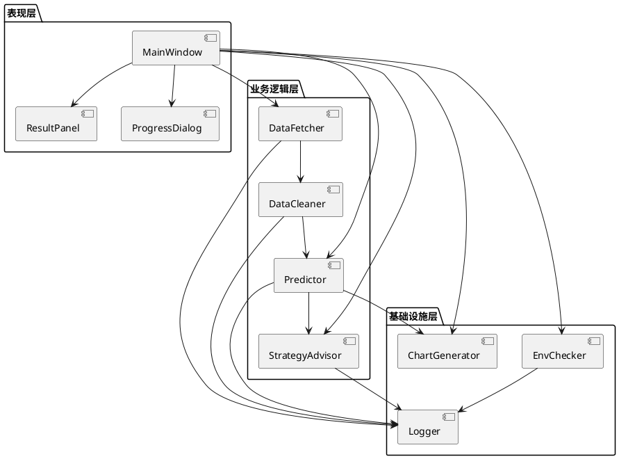

# **1. 实现模型**

## **1.1 上下文视图**



## **1.2 服务/组件总体架构**

采用分层架构，自上而下分为三层：

### **表现层（UI Layer）**
- **MainWindow**：PyQt5 主窗口，包含基金代码输入框、模型选择下拉框、开始分析按钮、结果展示区域、导出按钮
- **ResultPanel**：结果展示面板，内嵌 matplotlib 图表和策略建议文本区域
- **ProgressDialog**：进度对话框，展示分析流程各阶段进度

### **业务逻辑层（Business Layer）**
- **DataFetcher**：数据获取服务，封装 AkShare API 调用，支持多基金并发获取
- **DataCleaner**：数据清洗服务，处理缺失值、异常值、格式统一
- **Predictor**：趋势预测服务，包含 MA 保守型模型和 LSTM 激进型模型两种策略
- **StrategyAdvisor**：策略建议服务，基于预测结果生成买卖建议

### **基础设施层（Infrastructure Layer）**
- **EnvChecker**：环境检测服务，启动时检查依赖完整性并自动安装
- **Logger**：日志服务，统一记录运行日志到文件
- **ChartGenerator**：图表生成服务，基于 matplotlib 生成可视化图表并支持导出

### **模块依赖关系**



## **1.3 实现设计文档**

### **1.3.1 DataFetcher - 数据获取模块**

**职责**：封装 AkShare API，获取基金历史净值、规模数据

**核心类**：`FundDataFetcher`

**关键方法**：
- `fetch_nav_history(fund_code, start_date, end_date) -> pd.DataFrame`：获取指定基金的历史净值数据
- `fetch_fund_info(fund_code) -> dict`：获取基金基本信息（名称、类型、规模）
- `fetch_batch(fund_codes, start_date, end_date) -> dict[str, pd.DataFrame]`：批量获取多只基金数据
- `validate_fund_code(code) -> bool`：校验基金代码格式（6位数字）

**数据源调用**：
- `ak.fund_etf_hist_em(symbol, start_date, end_date)` 获取 ETF 基金历史净值
- `ak.fund_open_fund_info_em(symbol, indicator)` 获取开放式基金信息

**异常处理**：
- 网络超时：设置 30 秒超时，重试 3 次
- 基金代码不存在：返回空 DataFrame，由上层提示用户
- API 限流：自动等待后重试

### **1.3.2 DataCleaner - 数据清洗模块**

**职责**：对原始数据进行清洗，确保数据质量

**核心类**：`FundDataCleaner`

**关键方法**：
- `clean(raw_df) -> pd.DataFrame`：执行完整清洗流程
- `fill_missing_values(df) -> pd.DataFrame`：前值填充缺失值
- `detect_outliers(df, threshold=0.2) -> pd.DataFrame`：检测涨跌幅超 20% 的异常值
- `unify_formats(df) -> pd.DataFrame`：统一日期格式（YYYY-MM-DD）和数值精度（4位小数）

**清洗流程**：
1. 检查必要列是否存在（日期、净值）
2. 按日期排序
3. 前值填充缺失净值
4. 计算日涨跌幅，标记超 20% 异常值
5. 统一日期格式和数值精度
6. 校验清洗后数据量 >= 30 条

### **1.3.3 Predictor - 趋势预测模块**

**职责**：基于清洗后数据执行趋势预测，支持两种模型

**核心类**：
- `PredictionEngine`：预测引擎，根据模型类型分发到具体策略
- `MAPredictor`：保守型预测策略（移动平均线）
- `LSTMPredictor`：激进型预测策略（LSTM 深度学习）

**PredictionEngine 关键方法**：
- `predict(df, model_type, days=30) -> PredictionResult`：执行预测
- `backtest(df, model_type) -> BacktestResult`：执行历史回测

**MAPredictor 算法设计**：
- 使用 5 日、10 日、20 日、60 日移动平均线
- 预测值 = 加权移动平均外推（近期权重更高）
- 置信区间 = 预测值 ± 2 × 历史波动率标准差 × √天数
- 回测：用历史前 80% 数据预测后 20%，与实际值对比

**LSTMPredictor 算法设计**：
- 网络结构：2 层 LSTM（64, 32 隐藏单元）+ 全连接层
- 输入特征：过去 60 个交易日的净值序列
- 输出：未来 30 个交易日净值预测
- 训练：Adam 优化器，MSE 损失，最多 100 轮，early stopping patience=10
- 置信区间：Monte Carlo Dropout 方法（前向传播 50 次取标准差）
- 回测：同 MA 策略
- 降级策略：训练失败时自动回退到 MAPredictor

**PredictionResult 数据结构**：
- `dates`：预测日期列表
- `values`：预测净值列表
- `upper_bound`：置信上界列表
- `lower_bound`：置信下界列表
- `model_type`：使用的模型类型
- `uncertainty_note`：不确定性标注文本

### **1.3.4 ChartGenerator - 图表生成模块**

**职责**：生成可视化图表，支持交互和导出

**核心类**：`FundChartGenerator`

**关键方法**：
- `generate_trend_chart(history_df, prediction_result) -> Figure`：生成历史走势+预测趋势图
- `generate_backtest_chart(backtest_result) -> Figure`：生成回测对比图
- `generate_flow_chart(fund_info_df) -> Figure`：生成资金流向图
- `export_chart(figure, filepath, format) -> bool`：导出图表为 PNG/JPG

**图表设计规范**：
- 使用 matplotlib + matplotlib-cjk-font 支持中文显示
- 图表尺寸：12 × 6 英寸，DPI 150
- 配色方案：历史数据蓝色实线，预测数据红色虚线，置信区间红色半透明填充
- 所有图表包含：标题、X 轴日期标签、Y 轴净值标签、图例、网格线
- 嵌入 PyQt5 使用 matplotlib 的 FigureCanvasQTAgg 后端，支持缩放和拖拽

### **1.3.5 StrategyAdvisor - 策略建议模块**

**职责**：基于预测结果生成买卖建议

**核心类**：`FundStrategyAdvisor`

**关键方法**：
- `generate_advice(prediction_result, current_nav, fund_info) -> StrategyAdvice`：生成策略建议
- `_evaluate_trend(prediction_result) -> str`：评估趋势方向（上涨/下跌/震荡）
- `_evaluate_valuation(current_nav, history_df) -> str`：评估估值水平（偏高/偏低/适中）

**建议生成逻辑**：
1. 计算预测期末净值相对当前净值的涨跌幅
2. 计算当前净值在历史净值分布中的分位数（估值水平）
3. 判定规则：
   - 涨跌幅 > 3% 且分位数 < 30% → 买入
   - 涨跌幅 < -3% 且分位数 > 70% → 卖出
   - 其他 → 持有
4. 生成理由文本（包含涨跌幅、估值分位数等数据支撑）
5. 附加免责声明

**StrategyAdvice 数据结构**：
- `action`：建议类型（买入/卖出/持有）
- `reason`：理由文本
- `disclaimer`：免责声明（固定文本）

### **1.3.6 MainWindow - 主界面模块**

**职责**：提供用户交互界面，协调各模块执行

**核心类**：`FundPredictorMainWindow(QMainWindow)`

**界面布局**：
- 顶部区域：基金代码输入框（QLineEdit）、模型选择下拉框（QComboBox）、开始分析按钮（QPushButton）
- 中部区域：选项卡（QTabWidget），包含"趋势图"、"回测对比"、"资金流向"三个 Tab
- 底部区域：策略建议文本框（QTextEdit）、导出按钮（QPushButton）、版本号标签
- 状态栏：显示当前操作状态和进度

**核心流程**：
1. 用户输入基金代码，选择模型类型
2. 点击"开始分析"按钮
3. 在 QThread 中执行：数据获取 → 数据清洗 → 趋势预测 → 图表生成 → 策略建议
4. 通过信号槽机制更新 UI，避免阻塞主线程
5. 展示结果图表和策略建议

### **1.3.7 EnvChecker - 环境检测模块**

**职责**：启动时检测并安装依赖

**核心类**：`EnvironmentChecker`

**关键方法**：
- `check_and_install() -> bool`：检测所有依赖，缺失则自动安装
- `check_package(package_name) -> bool`：检测单个包是否已安装
- `install_package(package_name) -> bool`：自动安装单个包

**检测逻辑**：
1. 遍历 requirements.txt 中的依赖列表
2. 逐个 import 检测是否可用
3. 缺失的依赖使用 subprocess 调用 pip install 安装
4. 安装失败则记录日志并提示用户手动安装命令

# **2. 接口设计**

## **2.1 总体设计**

本工具为桌面应用，无对外暴露的 API 接口。模块间通过 Python 函数调用交互，数据传递使用 pandas DataFrame 和自定义数据类。

## **2.2 接口清单**

### **内部模块接口**

| 接口名称 | 提供方 | 调用方 | 输入 | 输出 | 说明 |
|---------|--------|--------|------|------|------|
| fetch_nav_history | DataFetcher | MainWindow | fund_code, start_date, end_date | pd.DataFrame | 获取基金历史净值 |
| fetch_batch | DataFetcher | MainWindow | fund_codes, start_date, end_date | dict[str, DataFrame] | 批量获取基金数据 |
| clean | DataCleaner | DataFetcher | raw_df | pd.DataFrame | 数据清洗 |
| predict | PredictionEngine | MainWindow | df, model_type, days | PredictionResult | 趋势预测 |
| backtest | PredictionEngine | MainWindow | df, model_type | BacktestResult | 历史回测 |
| generate_trend_chart | ChartGenerator | MainWindow | history_df, prediction_result | matplotlib.Figure | 生成趋势图 |
| generate_backtest_chart | ChartGenerator | MainWindow | backtest_result | matplotlib.Figure | 生成回测图 |
| generate_flow_chart | ChartGenerator | MainWindow | fund_info_df | matplotlib.Figure | 生成流向图 |
| export_chart | ChartGenerator | MainWindow | figure, filepath, format | bool | 导出图片 |
| generate_advice | StrategyAdvisor | MainWindow | prediction_result, current_nav, fund_info | StrategyAdvice | 生成策略建议 |
| check_and_install | EnvChecker | MainWindow | 无 | bool | 环境检测与安装 |

### **外部 API 接口**

| 接口名称 | 提供方 | 调用方 | 说明 |
|---------|--------|--------|------|
| ak.fund_etf_hist_em | AkShare | DataFetcher | 获取 ETF 基金历史数据 |
| ak.fund_open_fund_info_em | AkShare | DataFetcher | 获取开放式基金信息 |

# **4. 数据模型**

## **4.1 设计目标**

数据模型用于在模块间传递结构化数据，采用 Python dataclass 定义，不涉及数据库存储。所有数据仅在内存中处理，图表导出为文件系统中的图片文件。

## **4.2 模型实现**

### **4.2.1 PredictionResult - 预测结果**

```python
@dataclass
class PredictionResult:
    fund_code: str              # 基金代码
    dates: list[str]            # 预测日期列表 (YYYY-MM-DD)
    values: list[float]         # 预测净值列表
    upper_bound: list[float]    # 置信上界列表
    lower_bound: list[float]    # 置信下界列表
    model_type: str             # 模型类型 ("MA" / "LSTM")
    uncertainty_note: str       # 不确定性标注
```

### **4.2.2 BacktestResult - 回测结果**

```python
@dataclass
class BacktestResult:
    fund_code: str              # 基金代码
    actual_dates: list[str]     # 实际日期
    actual_values: list[float]  # 实际净值
    predicted_values: list[float]  # 回测预测净值
    mape: float                 # 平均绝对百分比误差
    model_type: str             # 模型类型
```

### **4.2.3 StrategyAdvice - 策略建议**

```python
@dataclass
class StrategyAdvice:
    fund_code: str              # 基金代码
    action: str                 # 建议类型 ("买入" / "卖出" / "持有")
    reason: str                 # 建议理由 (不超过200字)
    disclaimer: str             # 免责声明 (固定文本)
```

### **4.2.4 FundInfo - 基金基本信息**

```python
@dataclass
class FundInfo:
    code: str                   # 基金代码
    name: str                   # 基金名称
    fund_type: str              # 基金类型
    scale: float                # 基金规模 (亿元)
    current_nav: float          # 当前净值
    nav_date: str               # 净值日期
```

### **4.2.5 历史净值 DataFrame 结构**

| 列名 | 类型 | 说明 |
|------|------|------|
| date | str | 交易日期 (YYYY-MM-DD) |
| nav | float | 单位净值 (4位小数) |
| acc_nav | float | 累计净值 (4位小数) |
| daily_return | float | 日涨跌幅 (2位小数) |
| is_outlier | bool | 是否为异常值标记 |
