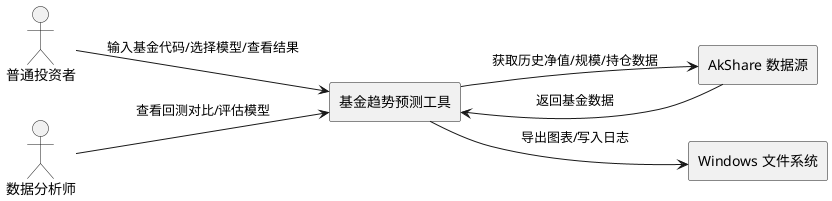
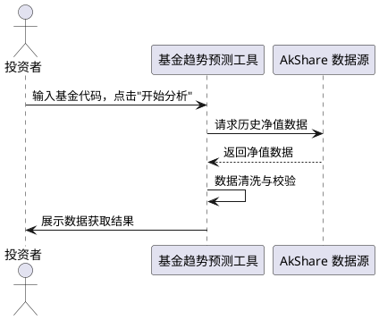
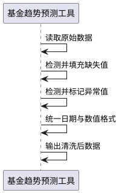
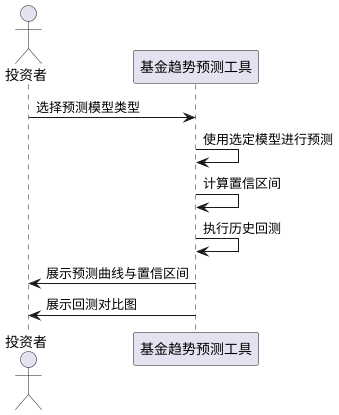
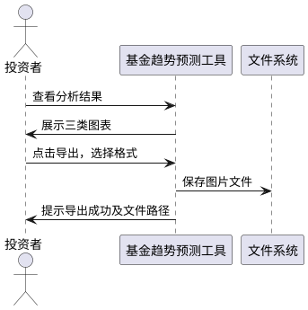
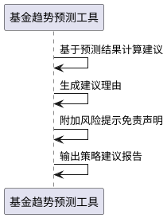
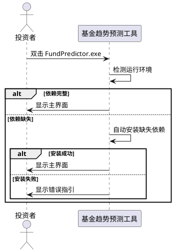

# **1. 组件定位**

## **1.1 核心职责**

本组件负责自动获取基金历史数据并预测未来趋势，实现投资者一键获得基金分析结论与操作建议。

## **1.2 核心输入**

1. **基金代码输入**：用户在界面输入一个或多个有效基金代码（如 000001、110011 等）
2. **预测模型选择**：用户选择预测模型类型（保守型/激进型），默认为保守型
3. **分析时间范围**：用户指定历史数据回溯时间范围，默认为最近一年
4. **一键启动指令**：用户点击"开始分析"按钮触发完整分析流程

## **1.3 核心输出**

1. **历史走势图表**：展示指定基金的历史净值走势曲线
2. **预测趋势图表**：展示未来 30 个交易日的净值预测曲线及置信区间
3. **预测对比图**：将历史实际值与模型回测预测值进行对比展示
4. **资金流向图**：展示基金规模变化与资金流入流出趋势
5. **策略建议报告**：包含"买入/卖出/持有"建议、理由及风险提示免责声明
6. **导出图片文件**：支持将图表导出为 PNG/JPG 格式
7. **错误提示信息**：网络异常或数据不可用时的友好提示

## **1.4 职责边界**

1. 本组件不负责用户账户管理或身份认证
2. 本组件不负责交易执行，仅提供分析建议
3. 本组件不负责实时行情推送，仅基于历史数据进行分析
4. 本组件不负责多平台数据源聚合，默认使用单一数据源（AkShare）
5. 本组件不保证预测结果的准确性，预测仅供参考

# **2. 领域术语**

**基金代码**
: 由 6 位数字组成的基金唯一标识符，如 000001、110011。
: 备注：需区分开放式基金与 ETF 基金代码格式。

**历史净值**
: 基金在过去每个交易日结束后的单位净值数据，包含日期和净值两个维度。

**预测净值**
: 基于历史净值数据，通过算法模型推算出的未来 30 个交易日的预估单位净值。
: 备注：预测值存在不确定性，需标注置信区间。

**置信区间**
: 预测值的上下界范围，表示预测值可能落入的区间，反映预测的不确定性程度。

**保守型模型**
: 基于移动平均线（MA）的预测策略，波动较小，适合稳健型投资者参考。

**激进型模型**
: 基于 LSTM 深度学习模型的预测策略，对趋势变化更敏感，但不确定性更大。

**策略建议**
: 基于预测结果和当前估值，给出的"买入/卖出/持有"操作建议及理由说明。

**回测对比**
: 将模型对历史区间的预测值与实际值进行对比，用于评估模型拟合效果。

**资金流向**
: 基金规模的变化趋势，反映资金流入或流出的方向与力度。

# **3. 角色与边界**

## **3.1 核心角色**

- **普通投资者**：非技术背景用户，通过输入基金代码获取分析结论，关注操作简便性和结论可读性
- **数据分析师**：关注数据源准确性、算法合理性及模型回测效果，作为内部参考用户

## **3.2 外部系统**

- **AkShare 数据源**：开源金融数据接口，提供基金历史净值、规模、持仓等公开数据
- **Windows 文件系统**：用于导出图表图片文件（PNG/JPG）及存储运行日志

## **3.3 交互上下文**

# **4. DFX约束**

## **4.1 性能**

1. 单只基金从输入代码到生成完整报告，耗时不得超过 2 分钟（网络正常情况下）
2. 批量分析（最多 10 只基金）总耗时不得超过 10 分钟
3. 图表渲染时间不得超过 5 秒
4. 内存占用峰值不得超过 1GB

## **4.2 可靠性**

1. 网络中断时，软件必须显示友好提示而非崩溃
2. 数据源返回异常数据时，必须跳过异常并继续处理有效数据
3. 软件启动时自动检测依赖环境，缺失时自动安装或给出明确指引
4. 运行过程中产生的错误必须记录到日志文件

## **4.3 安全性**

1. 软件不得存储或传输用户密码等敏感信息
2. API 调用参数需做脱敏处理，日志中不得记录完整 API 密钥
3. 策略建议必须附带显著的风险提示免责声明

## **4.4 可维护性**

1. 运行错误必须写入日志文件，包含时间戳、错误级别和错误详情
2. 日志文件存储于软件同级目录下的 logs 文件夹
3. 软件版本号必须在界面中展示

## **4.5 兼容性**

1. 运行环境为 Windows 10/11 操作系统
2. 打包为 .exe 可执行文件，双击即可运行，无需手动安装 Python 环境
3. 导出图片格式支持 PNG 和 JPG 两种

# **5. 核心能力**

## **5.1 数据获取**

### **5.1.1 业务规则**

1. **基金代码校验**：用户输入的基金代码必须为 6 位数字格式
   a. 验收条件：[用户输入非 6 位数字] → [提示"基金代码格式错误，请输入 6 位数字代码"]

2. **多基金支持**：必须支持同时输入多个基金代码，以逗号或空格分隔
   a. 验收条件：[用户输入"000001,110011"] → [系统同时获取两只基金数据]

3. **数据获取范围**：默认获取最近一年的历史净值数据，用户可自定义时间范围
   a. 验收条件：[用户未指定时间范围] → [默认获取最近 250 个交易日数据]

4. **数据完整性校验**：获取的数据必须包含日期和净值字段，缺失关键字段的数据记录必须被标记
   a. 验收条件：[API 返回缺少净值字段的记录] → [该记录被标记为异常，不参与后续计算]

### **5.1.2 交互流程**

### **5.1.3 异常场景**

1. **基金代码无效**
   a. 触发条件：用户输入的基金代码在数据源中不存在
   b. 系统行为：跳过该基金代码，继续处理其他有效代码
   c. 用户感知：提示"基金代码 XXXXXX 不存在，已跳过"

2. **网络连接失败**
   a. 触发条件：无法连接到 AkShare 数据源
   b. 系统行为：终止数据获取流程，记录错误日志
   c. 用户感知：提示"网络连接失败，请检查网络后重试"

3. **数据源返回空数据**
   a. 触发条件：API 返回的数据为空或无有效记录
   b. 系统行为：标记该基金数据获取失败
   c. 用户感知：提示"基金 XXXXXX 暂无历史数据"

## **5.2 数据清洗**

### **5.2.1 业务规则**

1. **缺失值处理**：净值数据中的缺失值必须使用前一个交易日的净值进行填充
   a. 验收条件：[某交易日净值缺失] → [使用前一交易日净值填充]

2. **异常值检测**：单日净值涨跌幅超过 20% 的记录必须标记为异常值
   a. 验收条件：[某日净值相对前日涨跌幅 > 20%] → [标记为异常值，提示用户确认]

3. **日期格式统一**：所有日期必须统一为 YYYY-MM-DD 格式
   a. 验收条件：[输入日期为 2024年1月1日] → [转换为 2024-01-01]

4. **数值精度统一**：净值数据保留 4 位小数
   a. 验收条件：[净值输入为 1.234567] → [保留为 1.2346]

### **5.2.2 交互流程**

### **5.2.3 异常场景**

1. **全部数据异常**
   a. 触发条件：清洗后有效数据不足 30 个交易日
   b. 系统行为：终止该基金的分析流程
   c. 用户感知：提示"基金 XXXXXX 有效数据不足，无法进行分析"

## **5.3 趋势预测**

### **5.3.1 业务规则**

1. **预测周期**：必须预测未来 30 个交易日的净值走势
   a. 验收条件：[用户点击开始分析] → [生成未来 30 个交易日预测值]

2. **模型选择**：必须支持保守型（移动平均线）和激进型（LSTM）两种预测模型
   a. 验收条件：[用户选择保守型] → [使用 MA 模型进行预测]
   b. 验收条件：[用户选择激进型] → [使用 LSTM 模型进行预测]

3. **不确定性标注**：预测结果必须包含置信区间，明确标注预测存在不确定性
   a. 验收条件：[预测图表展示] → [图表中必须显示置信区间上下界]

4. **回测验证**：必须对历史数据进行回测，展示模型拟合效果
   a. 验收条件：[预测完成] → [生成历史区间回测对比图]

5. **禁止项**：禁止在预测结果中给出确定性承诺
   a. 验收条件：[任何预测展示] → [必须附带"预测仅供参考，不构成投资建议"提示]

### **5.3.2 交互流程**

### **5.3.3 异常场景**

1. **模型训练失败**
   a. 触发条件：LSTM 模型训练过程中出现数值溢出或收敛失败
   b. 系统行为：自动降级为保守型模型重新预测
   c. 用户感知：提示"激进型模型训练失败，已自动切换为保守型模型"

2. **历史数据不足**
   a. 触发条件：有效历史数据不足 60 个交易日，无法进行模型训练
   b. 系统行为：终止预测流程
   c. 用户感知：提示"历史数据不足（需至少 60 个交易日），无法进行预测"

## **5.4 图表生成**

### **5.4.1 业务规则**

1. **图表类型**：必须生成以下三类图表
   - 历史走势图：展示历史净值曲线
   - 预测对比图：展示历史实际值与预测值对比
   - 资金流向图：展示基金规模变化趋势
   a. 验收条件：[分析完成] → [同时生成三类图表]

2. **图表美观性**：图表必须包含标题、坐标轴标签、图例、网格线
   a. 验收条件：[图表展示] → [包含标题、X/Y 轴标签、图例、网格线]

3. **图表缩放**：图表必须支持鼠标滚轮缩放和拖拽平移
   a. 验收条件：[用户滚动鼠标滚轮] → [图表相应缩放]

4. **图片导出**：支持将图表导出为 PNG 或 JPG 格式
   a. 验收条件：[用户点击导出按钮] → [弹出格式选择，保存图片到本地]

### **5.4.2 交互流程**

### **5.4.3 异常场景**

1. **导出路径不可写**
   a. 触发条件：用户选择的导出目录没有写入权限
   b. 系统行为：提示用户选择其他目录
   c. 用户感知：提示"导出路径无法写入，请选择其他目录"

## **5.5 策略建议**

### **5.5.1 业务规则**

1. **建议生成逻辑**：基于预测趋势和当前估值，给出"买入/卖出/持有"建议
   - 预测趋势上涨且当前估值偏低 → 买入
   - 预测趋势下跌且当前估值偏高 → 卖出
   - 其他情况 → 持有
   a. 验收条件：[预测上涨 + 估值偏低] → [建议"买入"]

2. **建议理由**：每条建议必须附带简明的理由说明
   a. 验收条件：[建议展示] → [包含建议类型 + 理由文字说明]

3. **风险提示**：所有策略建议必须附带显著的免责声明
   a. 验收条件：[建议展示] → [必须包含"投资有风险，决策需谨慎，本建议不构成投资指导"免责声明]

4. **禁止项**：禁止给出确定性收益承诺
   a. 验收条件：[任何建议展示] → [不得出现"保证收益""稳赚"等确定性表述]

### **5.5.2 交互流程**

### **5.5.3 异常场景**

1. **预测数据异常导致无法生成建议**
   a. 触发条件：预测结果全为 NaN 或无效值
   b. 系统行为：跳过建议生成
   c. 用户感知：提示"预测数据异常，无法生成策略建议"

## **5.6 一键启动**

### **5.6.1 业务规则**

1. **环境检测**：软件启动时必须自动检测运行环境，包括 Python 依赖库是否完整
   a. 验收条件：[软件启动] → [自动检测依赖环境]

2. **依赖自动安装**：若检测到缺失依赖，必须自动尝试安装
   a. 验收条件：[检测到缺失 numpy 库] → [自动执行 pip install numpy]

3. **双击运行**：打包为 .exe 文件，用户双击即可运行，无需手动配置 Python 环境
   a. 验收条件：[用户双击 FundPredictor.exe] → [软件正常启动并显示主界面]

4. **启动失败处理**：若依赖安装失败，必须给出明确的错误指引
   a. 验收条件：[依赖自动安装失败] → [显示具体失败原因和手动安装命令]

### **5.6.2 交互流程**

### **5.6.3 异常场景**

1. **关键依赖安装失败**
   a. 触发条件：核心依赖（如 numpy、pandas）自动安装失败
   b. 系统行为：记录错误日志，显示手动安装指引
   c. 用户感知：提示"依赖安装失败，请手动执行：pip install -r requirements.txt"

2. **端口或资源冲突**
   a. 触发条件：软件所需系统资源被占用
   b. 系统行为：尝试重试，记录日志
   c. 用户感知：提示"启动遇到问题，请关闭占用程序后重试"

# **6. 数据约束**

## **6.1 基金代码**

1. **代码格式**：6 位数字字符串，如 "000001"
2. **取值范围**：000001 ~ 999999
3. **必填性**：必须输入至少一个有效基金代码

## **6.2 历史净值记录**

1. **日期**：YYYY-MM-DD 格式，必须为有效交易日（排除周末和法定节假日）
2. **单位净值**：正数，保留 4 位小数，单位为元
3. **累计净值**：正数，保留 4 位小数，单位为元
4. **日涨跌幅**：百分比，保留 2 位小数，取值范围 -100% ~ +∞

## **6.3 预测净值记录**

1. **预测日期**：YYYY-MM-DD 格式，为未来 30 个交易日
2. **预测净值**：正数，保留 4 位小数
3. **置信上界**：大于等于预测净值，保留 4 位小数
4. **置信下界**：小于等于预测净值，保留 4 位小数，且大于 0
5. **不确定性标注**：必须标注"预测值存在不确定性"

## **6.4 策略建议**

1. **建议类型**：枚举值，仅允许"买入"、"卖出"、"持有"三种
2. **建议理由**：文本描述，不超过 200 字
3. **免责声明**：固定文本"投资有风险，决策需谨慎，本建议不构成投资指导"
4. **必填性**：免责声明为必填项，不可省略

## **6.5 预测模型配置**

1. **模型类型**：枚举值，仅允许"保守型"（MA）和"激进型"（LSTM）两种
2. **默认值**：保守型
3. **预测天数**：固定为 30 个交易日
4. **历史数据最低要求**：不少于 60 个交易日
